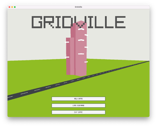
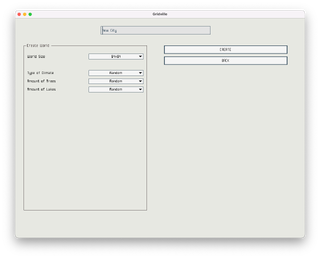
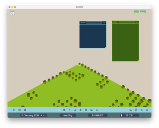
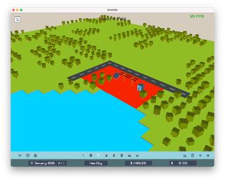
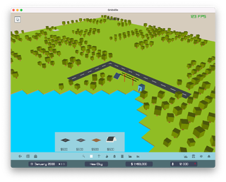

# Gridville

Gridville is my playful experiment in city-building—and a fun excuse to dive deep into mastering [Zig Lang](https://ziglang.org/) and the [Raylib graphics library](https://www.raylib.com/).

The world of Gridville is alive and closely connected to its neighboring cities, the state, and the global community we all share. When oil or soy prices rise on the global market, it actually matters here! If you’re developing a border town with a booming influx of immigrants, you’ll feel the impact. Got a massive military base in your city? That changes everything—from the types of businesses drawn to your streets, to the dynamics of crime and opportunity. Every decision you make echoes through your city and beyond. Let’s see what kind of world you can build!

* Blog - https://aerkalov.github.io/gridville/
* Wiki with more info - https://github.com/aerkalov/gridville/wiki

# Video

[Click to see Youtube playlist](https://www.youtube.com/playlist?list=PLrT8l4ds3GE6xun92vZIGZ-Cw56Nvf5tz)

# Screenshots

* Not the latest version of the game
