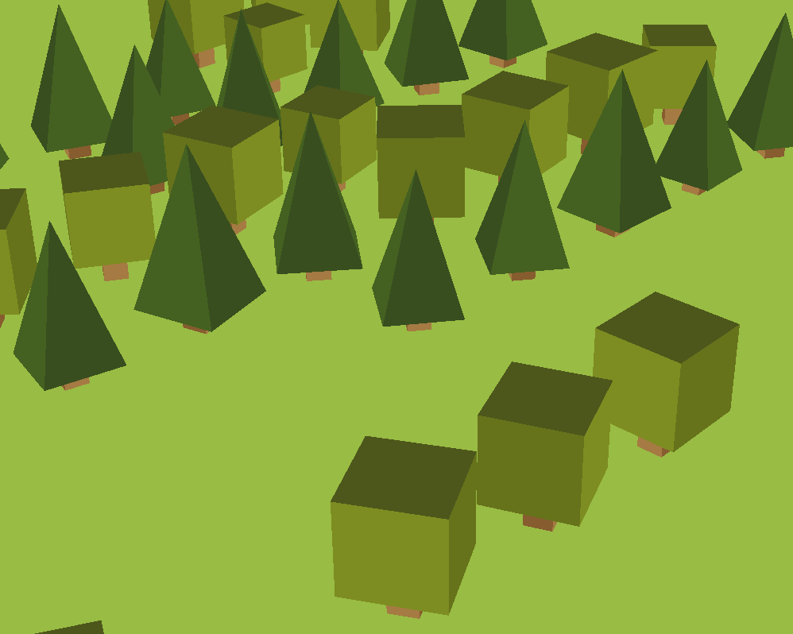
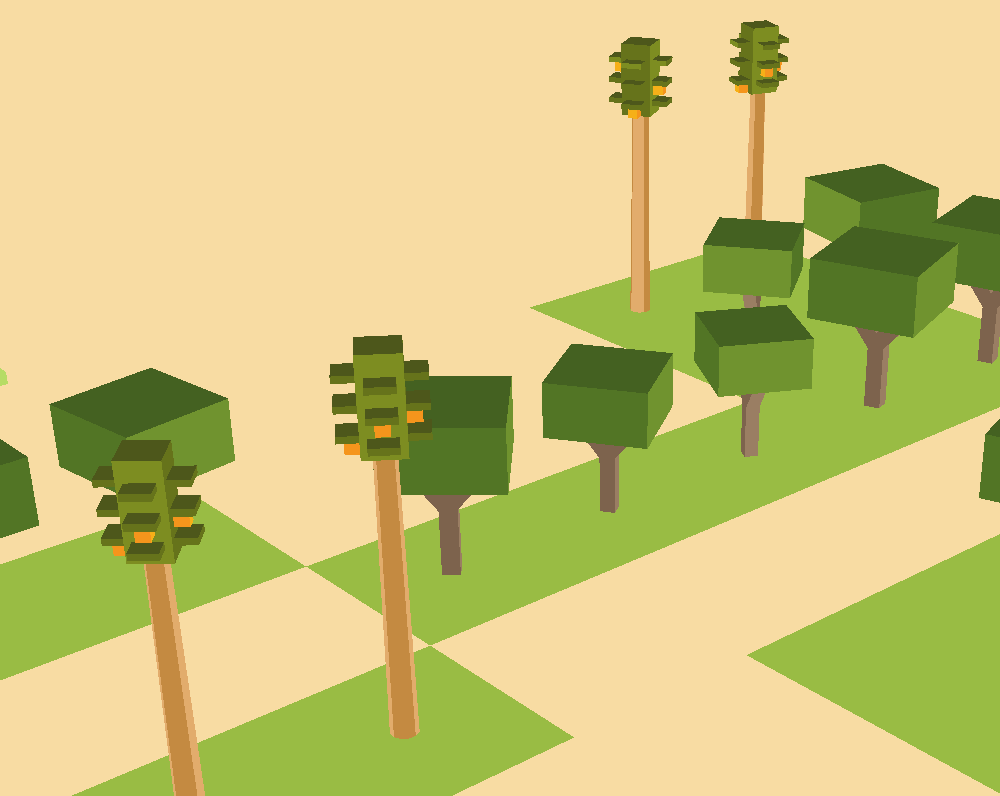
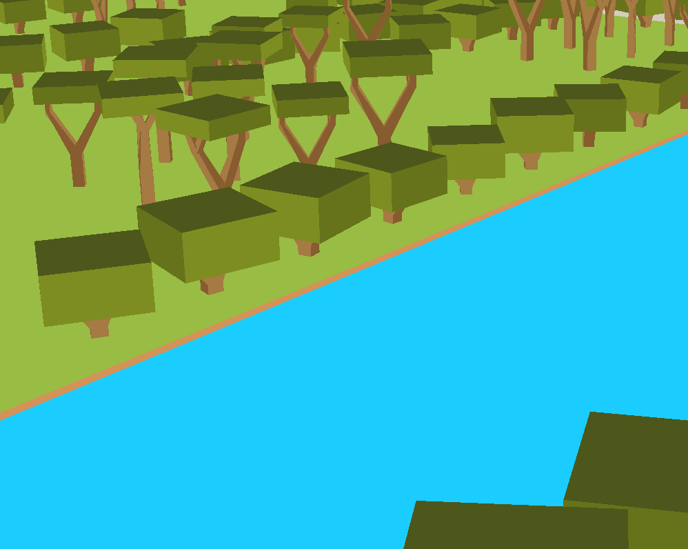
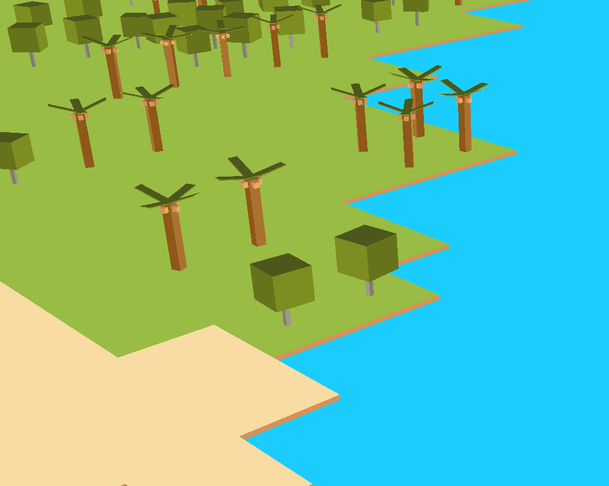

Your climate choice isn't just about aesthetics—it shapes your entire world. Pick a scorching desert, and you'll get endless sand dunes, maybe a river or two if you're lucky, and you'll be naming your landmarks in Arabic, French or English. Choose a lush tropical paradise, and watch rivers multiply, lakes dot your landscape, coconut trees flourish, and your city speaks in Spanish, French, or English. Go continental? Expect forests of pine and chestnut, moderate water features, and a Slavic or English language to match. Mediterranean vibes? Olive groves, stone pines, and the romance of Italian, French, Spanish or Arabic names. 

Currently, we've got some basic tree models to work with—nothing fancy yet! But here's where it gets exciting: I'm planning to add some real biological depth to the trees in the game. Think lifespan cycles, diseases that can strike, and how those nasty bugs spread from tree to tree.

## Continental

* Pine Tree
* Chestnut Tree

## Desert

* Date Palm
* Ghaf Tree

## Mediterranean

* Olive Tree
* Stone Pine

## Tropical

* Coconut
* Bread Fruit
