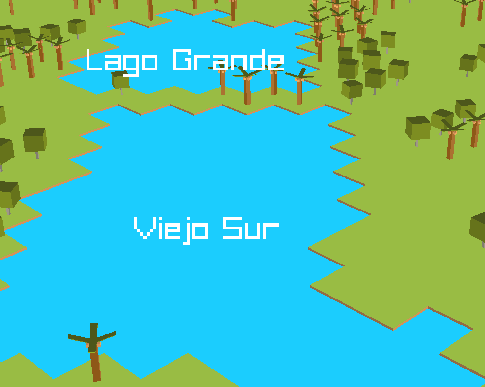

Besides rivers and oceans, lakes are also part of the game! Each lake is its own unique ecological world. Want a murky swamp that's not ideal for leisure or fish farms? You've got it. Prefer a pristine, sparkling lake perfect for recreational swimming? That's available too. Or maybe you'd like a lake tainted with sewage and pollution? The choice is yours. The temperature and water level fluctuate based on the climate, adding another layer of dynamism. Players will have access to detailed information about each lake—its depth, fish population, temperature, and even rare protected species that call it home. These aren't just random bodies of water; they're entire worlds waiting to be explored and managed.
